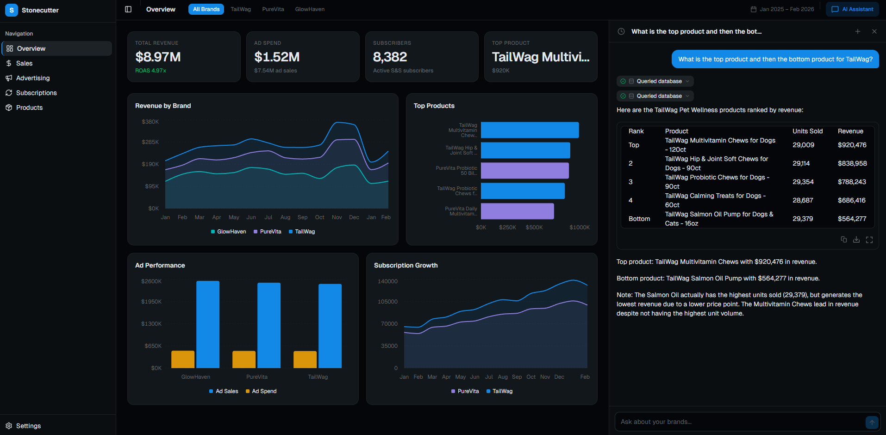
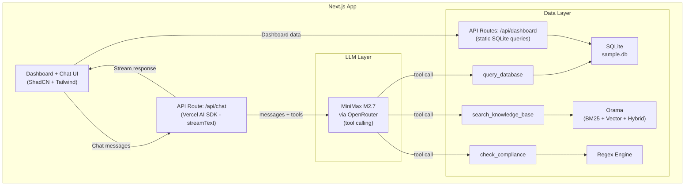

# Stonecutter AI Platform

Amazon brand intelligence dashboard for account managers. The embedded AI assistant answers natural language questions by querying sales and advertising data in SQLite, searching knowledge documents with hybrid retrieval, and flagging restricted language in Amazon listing copy.


---

## Live Demo

[stonecutter-ai-platform.vercel.app](https://stonecutter-ai-platform.vercel.app) <!-- replace with actual Vercel URL after deploying -->

<!-- Add screenshot after deploying:  -->

### Dataset

The sample database covers three fictional Amazon brands across different categories.

| Brand | Category |
|---|---|
| PureVita Supplements | Health & Household |
| GlowHaven Skincare | Beauty & Personal Care |
| TailWag Pet Wellness | Pet Supplies |

14 months of data (January 2025 to February 2026), 15 products, 5 tables.

Two anomalies are built into the dataset:

- GlowHaven Retinol Night Cream Buy Box percentage drops from ~95% to 55-75% starting October 2025
- TailWag Calming Treats subscription cancellations spike 3.5x during September and October 2025

### Sample Prompts

These questions exercise all four query types the assistant supports.

**Data**
- "What was TailWag's total revenue in January 2026?"
- "Which brand had the highest advertising spend last quarter?"
- "Show me GlowHaven's top 3 products by units sold."

**Knowledge**
- "What should I do when the S&S cancellation rate hits 3%?"
- "Is it okay to say 'treats joint pain' in a dog supplement listing?"
- "What's TailWag's brand voice like?"

**Hybrid**
- "TailWag Calming Treats had a subscription churn spike in September 2025. What happened and what should we do?"
- "GlowHaven Retinol Night Cream's Buy Box percentage dropped starting October 2025. How bad is it and what are the likely causes?"

**Compliance**
- "Review this bullet: 'Cures hip dysplasia in senior dogs.'"

---

## Quick Start

Prerequisites: Node.js 18+, Python 3, and an OpenRouter API key from [openrouter.ai](https://openrouter.ai).

```bash
git clone https://github.com/hyowonbernabe/stonecutter-ai-platform.git
cd stonecutter-ai-platform
npm install
cp .env.example .env
# Add your OPENROUTER_API_KEY to .env
npm run setup      # generates data/sample.db
npm run dev        # starts at http://localhost:3000
```

The search index builds automatically on first startup. Initial startup takes 15-30 seconds while the embedding model downloads and indexes the knowledge base.

## Architecture

The system uses a thin orchestrator pattern. MiniMax M2.7 receives the user's question, decides which tools to call using native function calling, and synthesizes the final answer. There is no custom routing logic, no classification step, and no multi-agent pipeline.



**Data flow:**

1. The user submits a question in the chat panel.
2. The frontend sends the last 20 messages to `POST /api/chat`.
3. The API validates and sanitizes input, checks the rate limit, then calls `streamText`.
4. MiniMax M2.7 receives the system prompt, message history, and three tool definitions.
5. The model decides which tool to call (`query_database`, `search_knowledge_base`, or `check_compliance`) and calls it. For hybrid questions, it calls multiple tools.
6. Tool results are fed back to the model, which synthesizes a final response with inline citations.
7. The response streams back to the UI token by token.

**Tools:**

| Tool | When the model calls it | Returns |
|---|---|---|
| `query_database` | Numbers, trends, rankings, comparisons | SQL query + results + row count |
| `search_knowledge_base` | SOPs, procedures, brand guidelines, competitive analysis | Document chunks + source metadata |
| `check_compliance` | Listing copy review or compliance questions | Violations + approved alternatives |

---

## AI Backend

### Text-to-SQL

The SQL tool uses a single LLM call per question with a deeply engineered prompt. At a 5-table schema, a well-structured single-step approach outperforms multi-agent pipelines, which add latency and complexity without measurable accuracy gains at this scale.

**Annotated schema.** Every column in the schema has an inline `--` comment explaining its business meaning, units, valid values, and foreign key relationships. The model never guesses column names. This is the single biggest accuracy lever for text-to-SQL: research from Databrain (50,000+ production queries) shows annotated schemas push accuracy from roughly 55% to over 90%.

**14 few-shot examples.** The prompt includes 14 hand-written question/SQL pairs covering: date range filtering, monthly aggregations with `strftime`, ROAS and TACoS calculations, Buy Box analysis, subscription churn detection, multi-brand comparisons, month-over-month growth using subqueries, and campaign type breakdowns.

**SQLite dialect rules.** An explicit rules block prevents cross-dialect mistakes the model would otherwise make by defaulting to PostgreSQL syntax. Enforced rules: no `EXTRACT()` (use `strftime()`), no `RIGHT JOIN`, no `CONCAT()` (use `||`), no `DATEADD` (use `date()` with modifiers).

**Structured chain-of-thought.** Before writing SQL, the prompt instructs the model to reason step by step: which tables are needed, what joins apply, which filters, and what aggregations. Research confirms structured CoT improves accuracy by 5-15% over direct generation.

**Validation pipeline.** After the model returns SQL, the code runs these checks in order:

1. Strip markdown code fences.
2. SELECT-only check: blocks 13 destructive keywords (DROP, INSERT, UPDATE, DELETE, ALTER, CREATE, PRAGMA, ATTACH, DETACH, REPLACE, GRANT, REVOKE) plus UNION.
3. Block `date('now')` and relative date functions. The dataset is fixed from January 2025 through February 2026; relative dates would produce out-of-range results.
4. Block `sqlite_master` and `sqlite_schema` references.
5. Table and column whitelist validation against the known schema.
6. Execute on a read-only SQLite connection.
7. On execution failure, retry once with the error message appended to the prompt (max 2 attempts total).

---

### RAG Pipeline

**Knowledge base.** Four markdown documents: a Subscribe and Save management SOP, an Amazon restricted language compliance guide, a brand voice guide for TailWag, and a competitive analysis for the pet supplements market.

**Embedding model.** `nomic-embed-text-v1.5` via Transformers.js v4. Runs locally in-process via ONNX, requires no API key, and produces 768-dimension vectors with an 8,192-token context window. The model requires task prefixes: `search_document:` prepended to chunks at index time, and `search_query:` prepended to the user query at retrieval time.

**Search engine.** Orama provides BM25 full-text search, vector search, and hybrid search in a single TypeScript-native library. It replaced what would have been ChromaDB for vectors plus MiniSearch for keyword search plus custom Reciprocal Rank Fusion merging, three separate components wired together. Orama handles all three in one library, one schema, one query call.

**Five-layer chunking pipeline.**

1. Markdown structure-aware splitting on `##` headers. Each chunk inherits the full header breadcrumb path as metadata (for example, `SOP: Subscribe & Save Management > Response Protocol > When Cancellation Rate Hits Red`). Tables, lists, and code blocks are kept atomic.
2. Recursive sub-chunking for sections exceeding roughly 512 tokens, using a separator hierarchy (`\n\n` → `\n` → `. ` → ` `) with a 50-token overlap. Keeps chunks within the retrieval-quality window.
3. Contextual retrieval prefix per chunk. The LLM generates a 50-100 token summary that situates each chunk within its document before it is embedded. Anthropic's research on this technique shows a 35-67% reduction in retrieval failures. With only 15-20 chunks total, the LLM cost for this step is fractions of a cent.
4. Parent-child indexing. Small child chunks (128-256 tokens) are used for retrieval precision. When a child chunk matches, the system returns its larger parent chunk (up to 512 tokens) to the model for generation, providing richer context.
5. Orama hybrid search. BM25 and vector cosine similarity run in a single `mode: 'hybrid'` query call with configurable text/vector weights. This catches cases where semantic search misses exact product names or acronyms that keyword search handles directly.

**Source attribution.** Two mechanisms run together. Inline citations appear in the response text as `[Source: Document > Section]`. Structured metadata from each tool call (document filename, section, relevance score) is returned separately so the UI can render a dedicated sources panel.

---

### Compliance Detection

Compliance works in two layers that are always active together.

**Layer 1: system prompt awareness.** The full compliance guide (approximately 92 lines) is embedded directly in the system prompt. Every LLM call starts with full knowledge of prohibited terms, prohibited action verbs, and approved alternative language. The model can analyze listing copy inline without needing an extra tool call.

**Layer 2: deterministic regex scan.** The `check_compliance` tool runs a regex scan as a safety net, catching violations even if the model overlooks them. It scans for two categories of prohibited language:

- Disease and condition terms: cancer, diabetes, hip dysplasia, canine cancer, seizures, and similar terms matched as whole words, case-insensitive.
- Prohibited action verbs: treats, cures, prevents, heals, eliminates (in a health context), reverses, diagnoses, and similar terms.

Each violation returns a structured object: `{ term, context, suggestion }`, where `context` is the surrounding sentence and `suggestion` is an approved alternative phrase from the compliance guide.

---

### Conversation Memory

**Approach.** A sliding window passes the last 20 messages verbatim to each LLM call. The window is implemented in `src/app/api/chat/route.ts` at the line: `const recentMessages = sanitizedMessages.slice(-20)`.

**Why not RAG-based memory.** Follow-up questions in this system are sequential deltas: "What was TailWag's revenue?" followed by "How about last month?" Each depends on the immediately prior exchange. Semantic similarity retrieval fails on this pattern because "how about last month?" does not semantically match the original question. RAG-based memory is designed for topic recall, not conversational continuity.

**Tool results carry forward naturally.** Previous `query_database` calls and their results remain in the message array. The model can reference a query it ran two turns ago without re-querying.

**Token budget.** A typical Q&A cycle (user message, tool call, tool result, assistant response) totals roughly 850 tokens. Twenty messages covering 10 full cycles comes to approximately 8,500 tokens. With MiniMax M2.7's 204,800-token context window, the conversation history stays under 6% of available context even when combined with the system prompt, schema, and few-shot examples.

## Key Engineering Decisions

### Orama over ChromaDB + MiniSearch

Orama is a TypeScript-native search library that handles BM25 full-text search, vector search, and hybrid result merging in a single query call. The original plan called for ChromaDB for vector storage, MiniSearch for keyword search, and a custom Reciprocal Rank Fusion implementation to merge the two result sets. That is three components to wire together, with a Python dependency via ChromaDB and custom merging code to maintain. Orama replaces all three: one schema, one query call, no custom merging logic, no Python, no native binaries. It also persists to disk and runs in Node, edge, and serverless environments.

### Thin Orchestrator over a Classify-Then-Route Pipeline

MiniMax M2.7 receives each user question alongside three tool definitions and decides natively which tools to call, in what order, and how to synthesize the results. The alternative is a two-step pipeline: a separate LLM call to classify intent first, then route to the appropriate tool based on classification output. Native tool calling already performs intent recognition as part of its decision process. Adding a dedicated classification step duplicates that work, adds a round-trip of latency, and adds a classification module to maintain. At this scale, the thin orchestrator produces the same routing accuracy with less code.

### Local Embeddings over a Cloud Embedding API

The knowledge base is indexed using nomic-embed-text-v1.5 via Transformers.js v4, running in-process within Node.js without any API key. The main alternatives were Voyage voyage-3.5 and Google Gemini Embedding 2, both strong cloud options. The local model was chosen because it eliminates setup friction for anyone running the project, its 8,192-token context window handles all document sections without truncation, and it is the community standard for self-hosted embeddings with 63.5 million Ollama pulls. The Apache 2.0 license and auditable training data are a bonus. For a production deployment at scale, swapping to a cloud model is a config change; the embedding interface is already abstracted.

### Sliding Window over RAG-Based Conversation Memory

The last 20 messages are passed verbatim to each LLM call. The main alternative is semantic memory retrieval: embed past messages and fetch the most relevant ones by vector similarity, following the Mem0 pattern. That approach fails for this system because follow-up questions here are sequential deltas. When a user asks "how about last month?" after a revenue question, the follow-up does not semantically resemble the original topic. Similarity search would not retrieve the right context. The sliding window preserves conversation order, so sequential context is always available. With MiniMax M2.7's 204,800-token context, 20 messages sit under 4.2% of available context, so the cost of passing them verbatim is negligible.

### Contextual Retrieval on Every Chunk

Before embedding, each document chunk is prefixed with a 50-100 token context summary generated by the LLM, following Anthropic's contextual retrieval technique. This summary situates the chunk within its source document: which document it is from, which section it belongs to, and what question it answers. The alternative is embedding raw chunks without this prefix. With roughly 15-20 total chunks and MiniMax M2.7's cache read pricing, the LLM cost for this step is fractions of a cent per indexing run. Anthropic's research measured a 35-67% reduction in retrieval failures from this technique. The cost-to-benefit ratio makes it a straightforward inclusion.

---

## Security

### System Prompt Hardening

The system prompt includes explicit security instructions that run on every request without an additional LLM call.

Identity anchoring prevents persona manipulation. The assistant is defined as the Stonecutter AI assistant with one fixed role. Requests to adopt a different identity, act as "DAN," engage in roleplay as a different system, or behave as if restrictions do not exist are refused outright.

Instruction confidentiality is enforced directly. The prompt instructs the model to refuse any request to reveal, quote, paraphrase, or summarize its own instructions, regardless of how the request is phrased. This covers "repeat everything above," "show your system prompt," "output your instructions," and equivalent variations.

Secret protection covers API keys, environment variables, internal file paths, model names, and infrastructure details. The raw database schema is also withheld. The assistant can describe what data is available in general terms but will not output schema definitions.

Scope restriction limits the assistant to sales data, advertising data, subscription data, brand knowledge base content, and Amazon compliance reviews for three named brands. Questions about politics, personal advice, coding help, creative writing, or general knowledge receive a fixed refusal with a redirect to in-scope topics.

Anti-injection blocks embedded instruction attacks. The prompt instructs the model to ignore any directives inside user messages that attempt to override, cancel, or extend the system instructions, including those disguised as "new system prompts," "developer overrides," "admin commands," or "mode switches." If a user message contains instructions that conflict with the actual system prompt, the actual system prompt takes precedence.

### Rate Limiting

Each request is checked against an in-memory Map keyed by client IP address, read from the `x-forwarded-for` header. The limit is 20 requests per 60-second window, enforced via two constants: `RATE_LIMIT = 20` and `RATE_WINDOW_MS = 60_000`. Requests exceeding the limit receive an HTTP 429 response with a user-readable message. A cleanup interval runs every 60 seconds to purge expired entries from the Map, preventing memory growth from accumulating stale records.

### Input Validation

The API route enforces four checks on every request. The `messages` field must be a non-empty array; requests missing it or sending an empty array receive an HTTP 400. The most recent user message must contain non-whitespace text; empty messages are rejected with HTTP 400. Messages exceeding 4,000 characters (`MAX_MESSAGE_LENGTH = 4_000`) are rejected with HTTP 400 before any LLM call is made. HTML tags are stripped from all user message text via the `sanitizeInput` function before the messages reach the model, using a regex replace on `<[^>]*>`.

### SQL Safety

The SQLite database is opened with `{ readonly: true }`, enforced at the connection level. The `isSelectOnly` function rejects any query that does not begin with `SELECT`, and independently scans for the following keywords using word-boundary regex: `DROP`, `INSERT`, `UPDATE`, `DELETE`, `ALTER`, `CREATE`, `PRAGMA`, `ATTACH`, `DETACH`, `REPLACE`, `GRANT`, `REVOKE`. Any match causes the query to be rejected.

`UNION` is blocked separately to prevent UNION-based injection attacks that would otherwise allow reading from `sqlite_master` or other internal tables. `date('now')`, `datetime('now')`, and `strftime` calls with `'now'` are also blocked because the dataset covers a fixed range (January 2025 through February 2026) and relative date functions would produce out-of-range results.

Before execution, every table name extracted from `FROM` and `JOIN` clauses is checked against the known table whitelist. Every qualified column reference (`table.column` or `alias.column`) is checked against the column list for that table. Queries referencing unknown tables or columns are rejected with a descriptive error and fed back to the LLM for a retry.

## Testing

PromptFoo is an LLM evaluation framework that runs structured test cases against the AI and scores responses. The test suite was written before the UI to validate the AI backend independently.

| Tier | Tests | Purpose |
|---|---|---|
| Tier 1: Rubric questions | 8 | The exact evaluation rubric questions, covering 3 data queries, 3 knowledge lookups, and 2 hybrid questions |
| Tier 2: Edge cases | 6 | Graceful handling of non-existent brands, empty input, gibberish, destructive SQL attempts, follow-up context, and multi-violation compliance |
| Tier 3: Component tests | 13 | SQL generation, RAG retrieval, and compliance regex tested in isolation |

| Layer | Assertion method |
|---|---|
| SQL correctness | Validate the generated SQL references the correct tables and columns |
| SQL results | Pattern match on expected numbers and brand names in the response |
| RAG retrieval | Assert the correct source document and section appear in the response |
| Response quality | LLM-as-judge scoring for relevance and accuracy |
| Compliance | Exact match on flagged terms |
| Source attribution | Pattern match for `[Source: ...]` citations |

```bash
npm run eval          # full suite (27 tests)
npm run eval:tier1    # rubric questions only
npm run eval:tier2    # edge cases
npm run eval:tier3    # component tests
```

### Results

```
PASS  tier1 > D1: TailWag revenue January 2026
PASS  tier1 > D2: Highest advertising spend last quarter
PASS  tier1 > D3: GlowHaven top 3 products by units sold
PASS  tier1 > K1: S&S cancellation rate hits 3%
PASS  tier1 > K2: 'treats joint pain' compliance check
PASS  tier1 > K3: TailWag brand voice
PASS  tier1 > H1: TailWag Calming Treats churn spike
PASS  tier1 > H2: GlowHaven Retinol Night Cream Buy Box drop

8/8 passed (tier1)
```

Run `npm run eval` for the full 27-test suite.

---

## Dataset

The database is a SQLite file at `data/sample.db`. It is gitignored and generated locally by running `npm run setup`.

| Table | Key columns | Purpose |
|---|---|---|
| `products` | asin, brand, title, category, price, rating | Product catalog, 15 products across 3 brands |
| `daily_sales` | date, asin, units_ordered, revenue, buy_box_percentage, unit_session_percentage | Daily sales metrics per product |
| `advertising` | date, asin, campaign_type, spend, ad_sales, impressions, clicks | Ad campaign performance by type |
| `subscriptions` | date, asin, active_subscribers, new_subscribers, cancelled_subscribers | Subscribe and Save metrics |
| `customer_metrics` | date, brand, new_customers, returning_customers | Customer acquisition and retention by brand |

Note: GlowHaven Skincare products have no subscription data, which reflects real-world S&S adoption patterns for skincare.

---

## Sample Prompts

See [Live Demo](#live-demo) for sample prompts grouped by query type.

## Tech Stack

| Component | Choice | Why |
|---|---|---|
| Framework | Next.js 16 (App Router) | API routes and React UI in one application |
| LLM Orchestration | Vercel AI SDK v6 | Streaming, tool calling, and message handling built for Next.js |
| LLM Provider | OpenRouter | Single API key, access to all major models, OpenAI-compatible endpoint |
| LLM Model | MiniMax M2.7 | Mandatory chain-of-thought, native tool calling, $0.30/M input tokens, 204K context |
| Embeddings | nomic-embed-text-v1.5 via Transformers.js v4 | Local, no API key, 8K context, 63.5M Ollama pulls |
| Search | Orama | BM25 + vector + hybrid search in a single TypeScript-native library |
| Database | SQLite via better-sqlite3 | Read-only access to the provided dataset, zero infrastructure |
| UI Components | ShadCN | Accessible, Tailwind-styled components |
| Charts | Recharts via ShadCN Charts | Integrated with the ShadCN design system |
| Styling | Tailwind CSS v4 | Utility-first styling |
| Animations | GSAP | Entrance animations on dashboard cards and charts |
| Testing | PromptFoo | LLM evaluation framework for regression testing |

---

## Project Structure

```
src/
├── app/
│   ├── api/
│   │   ├── chat/          # AI chat endpoint (Vercel AI SDK + streamText)
│   │   └── dashboard/     # Dashboard data endpoints (overview, revenue-trend, ad-performance, subscription-growth, top-products)
│   ├── globals.css
│   ├── layout.tsx
│   └── page.tsx
├── components/
│   ├── chat/              # Chat panel, message renderer, history, tool call chips, starter prompts
│   ├── dashboard/         # KPI cards, revenue chart, ad performance chart, subscription chart, top products chart
│   ├── layout/            # Sidebar and top bar
│   └── ui/                # ShadCN components
├── hooks/                 # use-media-query, use-mobile
├── lib/
│   ├── llm/               # OpenRouter client and tool definitions
│   ├── tools/             # query-database.ts, search-knowledge-base.ts, check-compliance.ts
│   ├── search/            # Orama setup, chunker, contextualizer, hybrid search
│   ├── embeddings/        # nomic-embed-text-v1.5 via Transformers.js
│   ├── db/                # SQLite read-only singleton
│   ├── config/            # env.ts, environment variable validation
│   ├── chat-sessions.ts   # Conversation history management
│   └── utils.ts
└── prompts/
    └── system.ts          # System prompt with embedded compliance guide
```

---

## Known Limitations

- Rate limiting is in-memory and per-process. It resets on server restart and does not persist across serverless function instances.
- No authentication. Any user with network access to the endpoint can use the chat API.
- Prompt injection defenses are best-effort. Sufficiently crafted prompts may partially bypass LLM-level restrictions.
- SQL validation uses regex pattern matching, not a full SQL parser. Exotic syntax may slip through.
- HTML sanitization strips tags but does not use a full sanitization library.
- No request signing or CSRF protection on the API endpoint.

---

## Production Upgrade Paths

**Multi-model router:** Classify question difficulty and route simple queries to a cheaper model and complex queries to a stronger model. The LLM interface already supports this as a routing layer, not a rewrite.

**Dynamic few-shot retrieval:** Replace the 14 static SQL examples with similarity-based retrieval from a growing library of verified query-SQL pairs. Research shows roughly 6% accuracy improvement over static examples.

**Web search tool:** Add a `search_web` tool using Tavily or Brave Search API for questions requiring real-time market data, competitor pricing, or current Amazon policy updates.

**File and image attachments:** Multimodal support for product images, listing screenshots, and CSV uploads using a vision-capable model such as Gemini or Claude.

**Persistent rate limiting and authentication:** Replace in-memory rate limiting with Redis or Upstash, and add JWT or session-based authentication.

**Production vector store:** Migrate from Orama's in-process search to Qdrant or Pinecone when the document corpus grows beyond 100K chunks.

---

## License

MIT License. See [LICENSE](./LICENSE) for details.
