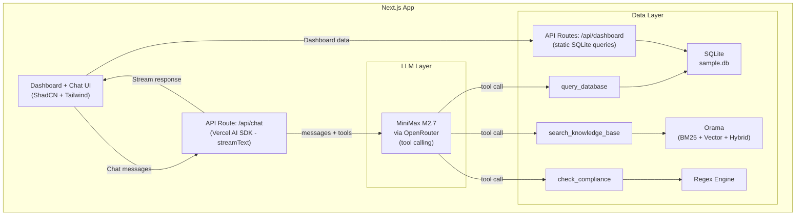
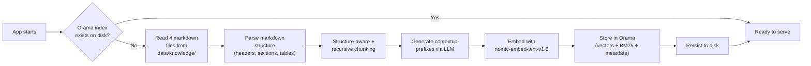

# Architecture

## System Diagram

## Data Flow

### Query Flow (runtime)

### Ingestion Flow (startup)

A separate `npm run setup` script is also available for explicit re-indexing.

## Component Boundaries

| Component | Responsibility | Interface |
|---|---|---|
| Chat API Route | Orchestrates LLM calls, manages message history, streams responses | HTTP POST /api/chat |
| Dashboard API Routes | Serve pre-defined SQLite queries for dashboard charts/metrics | HTTP GET /api/dashboard/* |
| LLM Service | Wraps OpenRouter API calls via Vercel AI SDK | `streamText(messages, tools)` |
| SQL Tool | Generates SQL, validates, executes against SQLite | `queryDatabase(question) → { sql, results, error }` |
| Knowledge Tool | Hybrid search (vector + BM25) over knowledge base | `searchKnowledgeBase(query) → { chunks, sources }` |
| Compliance Tool | Regex scan for restricted language | `checkCompliance(text) → { violations, suggestions }` |
| Ingestion Service | Processes markdown docs into Orama index | `ingestDocuments(paths) → void` |
| Embedding Service | Wraps nomic-embed-text-v1.5 via Transformers.js | `embed(texts) → vectors` |

Each component is a module with a defined interface. The concrete implementation can be swapped without changing consumers.

## Error Handling

Graceful error messages at each boundary. Every failure returns a user-friendly message — the system never crashes silently or shows raw stack traces.

| Failure | Handling |
|---|---|
| OpenRouter API down / timeout | Return: "I couldn't reach the AI model right now. Please try again in a moment." |
| OpenRouter invalid API key | Return: "The API key is invalid or missing. Check your OPENROUTER_API_KEY in .env." |
| OpenRouter rate limit | Return: "Rate limit reached. Please wait a moment and try again." |
| SQL execution error | Retry once with error feedback. On second failure, return: "I couldn't generate a valid query for that question. Try rephrasing." |
| Embedding model load failure | Return: "The embedding model is still loading. Please wait a moment and try again." On startup, log the error and retry initialization. |
| Orama index corrupted / missing | Re-initialize from source documents automatically. Log warning. |
| Malformed user input | The LLM handles this naturally — it asks for clarification or explains it can't help. |

**For production at scale:** Add retry with exponential backoff for transient failures, circuit breakers to prevent cascading failures, health check endpoints, and fallback models (if primary model is down, route to a backup). Structured error logging with correlation IDs for debugging.

## Decision: Why "Thin Orchestrator"

We considered three approaches:

1. **Thin Orchestrator (chosen)** — LLM orchestrates via native tool calling. One process, one command, minimal moving parts. The LLM handles routing naturally — this is the same pattern Claude, ChatGPT, and Gemini use for their tool-calling features. It is the established industry standard for agentic AI systems.
2. **Pipeline Architecture** — explicit classify → route → execute → synthesize stages. More control but adds a separate classification LLM call that duplicates what tool calling does natively. More code to maintain for no measurable benefit at this scale.
3. **Microservices Lite** — separate SQL engine, RAG engine, and orchestrator as independent services. True separation of concerns but massively overengineered for 5 tables and 4 documents. Defeats "run in 10 minutes."

**For production at scale:** Approach 3 (microservices) becomes the right choice when you need to scale SQL and RAG independently, deploy on different infrastructure, or have separate teams owning each component. The clean interfaces we define in Approach 1 make this migration straightforward — each tool becomes its own service behind the same interface.

## Security

### Threat Model

Internal agency tool used by account managers and evaluators. Primary threats: curious users probing the system, prompt injection attempts, and accidental misuse. Not hardened against sophisticated nation-state attackers.

### System Prompt Hardening

- **Identity anchoring** — the AI is locked to its Stonecutter assistant role and refuses persona switches (DAN, jailbreak, roleplay)
- **Instruction confidentiality** — explicit refusal to reveal, quote, or paraphrase the system prompt
- **Secret protection** — never reveals API keys, env vars, file paths, model names, or raw schema
- **Scope restriction** — only answers questions about brand data, knowledge base, and compliance; refuses politics, coding help, personal advice, and off-topic requests
- **Anti-injection** — instructions to ignore conflicting directives embedded in user messages
- **Tone control** — no emojis, no excessive punctuation, no filler phrases, professional tone enforced

### Rate Limiting

- **Mechanism:** In-memory Map keyed by client IP (from `x-forwarded-for` header)
- **Limit:** 20 requests per 60-second sliding window per IP
- **Response:** HTTP 429 with user-friendly message
- **Cleanup:** Stale entries purged every 60 seconds to prevent memory leaks
- **Limitation:** In-memory only — resets on server restart, does not persist across serverless instances. For production, replace with Redis or Upstash.

### Input Validation

| Check | Limit | Response |
|---|---|---|
| Message length | 4,000 characters max | 400 with explanation; client-side counter appears at 3,200 chars |
| Empty messages | Rejected | 400 with explanation |
| HTML tags | Stripped from user text before LLM | Silently sanitized |
| Messages array | Must be non-empty array | 400 with explanation |
| Conversation length | Sliding window (last 20 messages) | Older messages silently trimmed — no hard rejection |

### SQL Safety

| Protection | Description |
|---|---|
| Read-only connection | SQLite opened with `{ readonly: true }` |
| SELECT-only enforcement | Blocks DROP, INSERT, UPDATE, DELETE, ALTER, CREATE, PRAGMA, ATTACH, DETACH, REPLACE, GRANT, REVOKE |
| UNION blocking | Prevents UNION-based injection to query sqlite_master or other tables |
| sqlite_master/sqlite_schema blocking | Explicit check prevents schema exploration |
| Table/column whitelist | Only known tables and columns pass validation |
| Large result advisory | Soft warning at 200+ rows (no truncation) — suggests filters or LIMIT |
| Busy timeout | 5-second pragma to prevent long-running queries |
| Retry limit | Max 2 attempts per query; structured error on failure |

### Frontend Protections

- **Double-send prevention** — textarea and send button disabled when `status !== 'ready'` (AI SDK v6 canonical pattern), covering submitted, streaming, and error states
- **Error surfacing** — rate limit (429), validation (400), auth (401), streaming, and server (500) errors are caught and displayed with a "Try again" retry button
- **Streaming error forwarding** — `onError` callback on `toUIMessageStreamResponse` ensures mid-stream failures surface in the UI
- **Character limit feedback** — counter appears at 3,200+ characters (80% of 4,000 limit), turns red when exceeded, send blocked
- **Sliding window** — only the last 20 messages are sent to the API, limiting context exposure

### Known Limitations

- Rate limiting is in-memory and per-process — does not work across serverless function instances
- No authentication — any user with network access can use the chat endpoint
- Prompt injection defenses are best-effort — sufficiently creative prompts may partially bypass LLM-level restrictions
- SQL validation uses regex pattern matching, not a full SQL parser — exotic syntax may slip through
- No request signing or CSRF protection on the API endpoint
- HTML sanitization is basic tag stripping, not a full HTML sanitizer

**For production:** Add authentication (JWT/session), persistent rate limiting (Redis), WAF rules, request signing, structured audit logging, and consider a SQL parser library for validation.

## References

- Vercel AI SDK — streamText: https://ai-sdk.dev/docs/ai-sdk-core/generating-text
- Vercel AI SDK — tool calling: https://ai-sdk.dev/docs/ai-sdk-core/tools-and-tool-calling
- Next.js App Router: https://nextjs.org/docs/app
