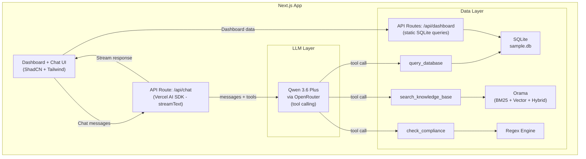
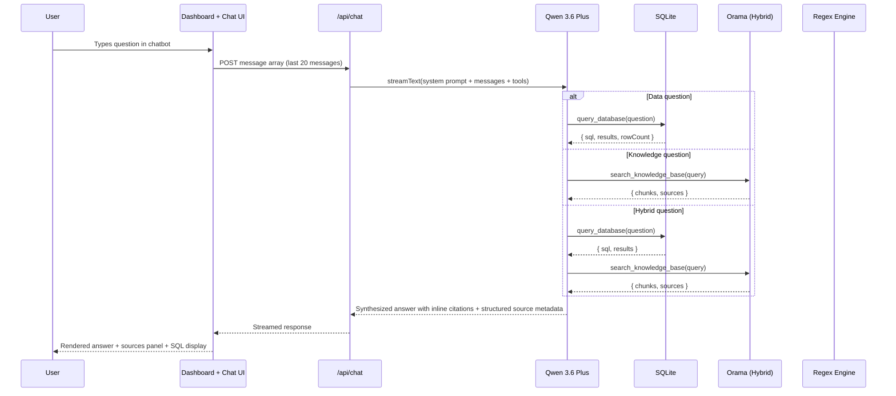
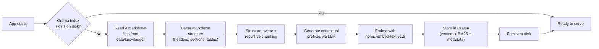

# Architecture

## System Diagram

## Data Flow

### Query Flow (runtime)

### Ingestion Flow (startup)

A separate `npm run setup` script is also available for explicit re-indexing.

## Component Boundaries

| Component | Responsibility | Interface |
|---|---|---|
| Chat API Route | Orchestrates LLM calls, manages message history, streams responses | HTTP POST /api/chat |
| Dashboard API Routes | Serve pre-defined SQLite queries for dashboard charts/metrics | HTTP GET /api/dashboard/* |
| LLM Service | Wraps OpenRouter API calls via Vercel AI SDK | `streamText(messages, tools)` |
| SQL Tool | Generates SQL, validates, executes against SQLite | `queryDatabase(question) → { sql, results, error }` |
| Knowledge Tool | Hybrid search (vector + BM25) over knowledge base | `searchKnowledgeBase(query) → { chunks, sources }` |
| Compliance Tool | Regex scan for restricted language | `checkCompliance(text) → { violations, suggestions }` |
| Ingestion Service | Processes markdown docs into Orama index | `ingestDocuments(paths) → void` |
| Embedding Service | Wraps nomic-embed-text-v1.5 via Transformers.js | `embed(texts) → vectors` |

Each component is a module with a defined interface. The concrete implementation can be swapped without changing consumers.

## Error Handling

Graceful error messages at each boundary. Every failure returns a user-friendly message — the system never crashes silently or shows raw stack traces.

| Failure | Handling |
|---|---|
| OpenRouter API down / timeout | Return: "I couldn't reach the AI model right now. Please try again in a moment." |
| OpenRouter invalid API key | Return: "The API key is invalid or missing. Check your OPENROUTER_API_KEY in .env." |
| OpenRouter rate limit | Return: "Rate limit reached. Please wait a moment and try again." |
| SQL execution error | Retry once with error feedback. On second failure, return: "I couldn't generate a valid query for that question. Try rephrasing." |
| Embedding model load failure | Return: "The embedding model is still loading. Please wait a moment and try again." On startup, log the error and retry initialization. |
| Orama index corrupted / missing | Re-initialize from source documents automatically. Log warning. |
| Malformed user input | The LLM handles this naturally — it asks for clarification or explains it can't help. |

**For production at scale:** Add retry with exponential backoff for transient failures, circuit breakers to prevent cascading failures, health check endpoints, and fallback models (if primary model is down, route to a backup). Structured error logging with correlation IDs for debugging.

## Decision: Why "Thin Orchestrator"

We considered three approaches:

1. **Thin Orchestrator (chosen)** — LLM orchestrates via native tool calling. One process, one command, minimal moving parts. The LLM handles routing naturally — this is the same pattern Claude, ChatGPT, and Gemini use for their tool-calling features. It is the established industry standard for agentic AI systems.
2. **Pipeline Architecture** — explicit classify → route → execute → synthesize stages. More control but adds a separate classification LLM call that duplicates what tool calling does natively. More code to maintain for no measurable benefit at this scale.
3. **Microservices Lite** — separate SQL engine, RAG engine, and orchestrator as independent services. True separation of concerns but massively overengineered for 5 tables and 4 documents. Defeats "run in 10 minutes."

**For production at scale:** Approach 3 (microservices) becomes the right choice when you need to scale SQL and RAG independently, deploy on different infrastructure, or have separate teams owning each component. The clean interfaces we define in Approach 1 make this migration straightforward — each tool becomes its own service behind the same interface.

## References

- Vercel AI SDK — streamText: https://ai-sdk.dev/docs/ai-sdk-core/generating-text
- Vercel AI SDK — tool calling: https://ai-sdk.dev/docs/ai-sdk-core/tools-and-tool-calling
- Next.js App Router: https://nextjs.org/docs/app
