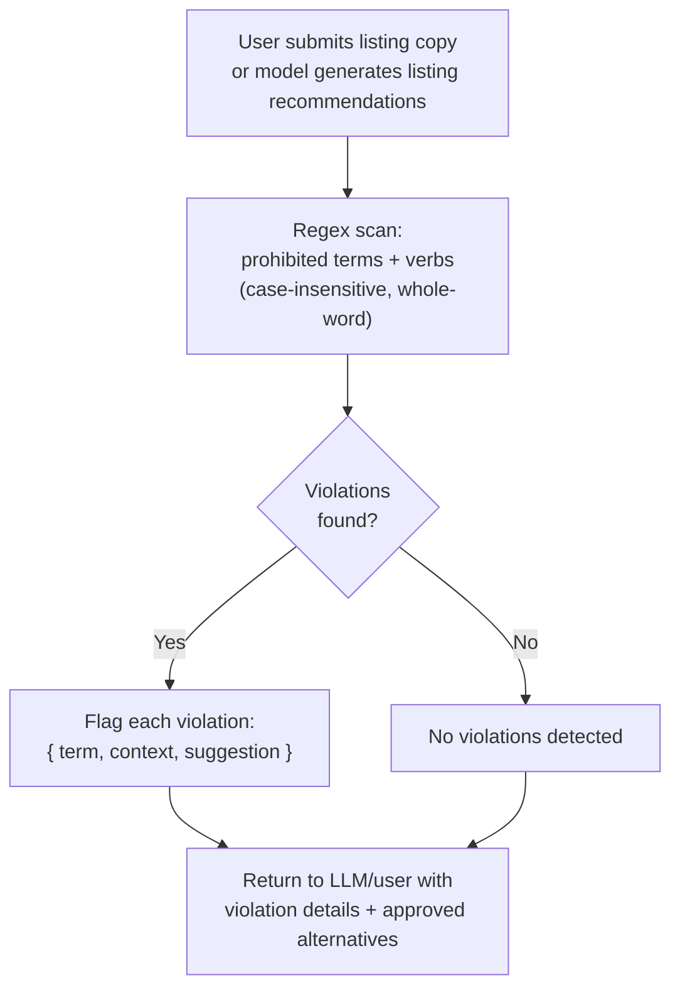

# Compliance Detection

## Approach: System Prompt + Keyword Regex

Two layers working together to ensure compliance awareness.

### Decision: Why This Approach

**Alternatives considered:**

| Approach | Why not chosen |
|---|---|
| **LLM-based compliance tool call** | Wasteful — the compliance guide is only ~92 lines and fits in the system prompt. The model already has the rules in context for every response. Adding a separate LLM call for compliance analysis is redundant and adds latency + cost for zero benefit. |
| **Fine-tuned classification model** | Requires labeled training data (compliant vs non-compliant examples). No labeled dataset available. Overkill for a well-defined prohibited terms list. |

**Why system prompt + regex won:**
- The compliance guide is small enough to include in the system prompt (~92 lines). The model is always compliance-aware — no extra call needed.
- Regex provides a deterministic safety net. It catches obvious violations even if the model somehow overlooks them.
- Zero extra LLM calls, zero extra cost, zero latency added.

**For production at scale:** Add a fine-tuned classification model trained on labeled examples of compliant vs non-compliant listing copy for higher precision on context-dependent violations. Build an automated listing audit pipeline — a scheduled batch job that scans all active listings against the compliance rules, flagging violations before they go live. Implement versioned compliance rules to track policy changes over time and apply the correct ruleset based on when a listing was published.

### Layer 1: System Prompt (Always-On Awareness)

The full compliance guide (~92 lines) is included in the system prompt. This means the model is always aware of:
- Prohibited disease/condition names (cancer, diabetes, hip dysplasia, etc.)
- Prohibited action verbs (treats, cures, prevents, heals, etc.)
- Approved alternative language ("treats joint pain" → "supports joint comfort and flexibility")
- Required disclaimers for supplement listings

When a user asks "is this listing copy compliant?" or submits text for review, the model can analyze it inline — no extra tool call needed. It already has the rules in context.

### Layer 2: Regex Engine (Deterministic Safety Net)

The `check_compliance` tool runs a regex scan over submitted listing copy. This catches obvious violations even if the model overlooks them.

### Compliance Check Flow



#### Prohibited Terms List

Two categories of patterns:

**Disease/condition terms** — matched as whole words, case-insensitive:
- cancer, tumor, diabetes, heart disease, alzheimer's, dementia, depression, arthritis, osteoporosis, hypertension, high blood pressure, high cholesterol, IBS, Crohn's, insomnia, ADHD, autism, Parkinson's, lupus, fibromyalgia, eczema, psoriasis, dermatitis, UTI, kidney disease, liver disease
- Pet-specific: hip dysplasia, canine cancer, feline leukemia, parvovirus, kennel cough, mange, seizures, epilepsy

**Prohibited verbs** — matched in health/wellness context, case-insensitive:
- treats, treat, treatment, cures, cure, prevents, prevent, prevention, heals, heal, healing, eliminates (symptoms/conditions), fights (disease), kills (bacteria/viruses), diagnoses, reverses (condition), repairs (tissue/organs)

#### Output

For each violation found:
```
{
  term: string,         // the matched prohibited term
  context: string,      // the surrounding sentence for context
  suggestion: string    // approved alternative from the compliance guide
}
```

#### Proactive Behavior

The regex scan fires automatically when:
- A user submits listing copy text for review
- The model's response includes product listing recommendations

This is what "flags restricted language proactively" means — the system catches violations without the user asking.

## References

- The compliance rules source: `data/knowledge/compliance-amazon-restricted-language.md`
