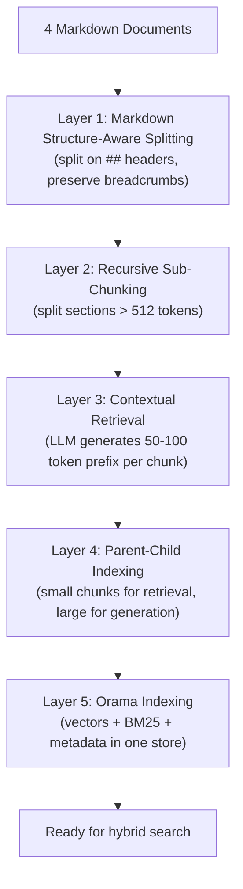
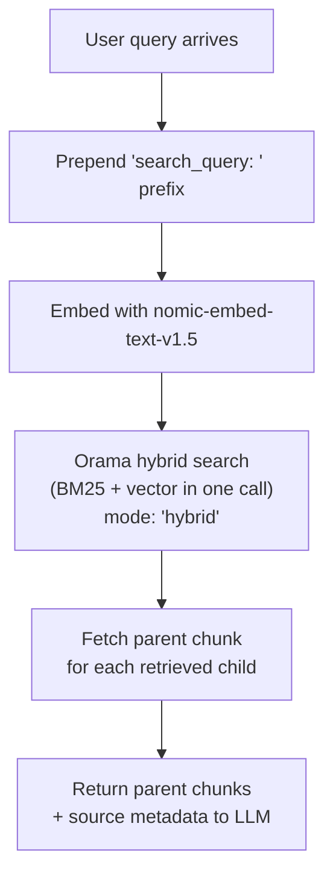

# RAG Implementation

## Knowledge Base

4 markdown documents in `data/knowledge/`:

| Document | Content | ~Lines |
|---|---|---|
| `sop-subscribe-and-save-management.md` | S&S management procedures, benchmarks, response protocols | 70 |
| `compliance-amazon-restricted-language.md` | Prohibited terms, verbs, approved alternatives | 92 |
| `brand-voice-guide-tailwag.md` | TailWag brand voice, tone, positioning | 76 |
| `competitive-analysis-pet-supplements.md` | Competitor landscape, market trends, strategy | 67 |

Total: ~305 lines, ~5,000 tokens. Small corpus — the embedding model choice matters less than chunking quality and retrieval strategy.

## Embedding Model: nomic-embed-text-v1.5

| Attribute | Value |
|---|---|
| Package | `@huggingface/transformers` (Transformers.js v4) |
| Model ID | `nomic-ai/nomic-embed-text-v1.5` |
| Dimensions | 768 |
| Max tokens | 8,192 |
| Matryoshka support | Yes (can truncate to 256, 512 dims) |
| License | Apache 2.0 |
| Runs locally | Yes — in-process via ONNX, no API key needed |

### Decision: Why nomic-embed-text-v1.5

**Alternatives considered:**

| Model | Strength | Why not chosen |
|---|---|---|
| `all-MiniLM-L6-v2` | Legacy default in many tutorials | Benchmarks show it is one of the weakest models still in common use (MTEB retrieval 51.68). Should NOT be used for new projects in 2026. 512 token limit. |
| `Xenova/bge-small-en-v1.5` | Small, fast (33M params) | Not recommended in 2025-2026 community discussions. 512 token hard limit. BAAI themselves point to BGE-M3 as the upgrade. Not first-class in Ollama. |
| `BGE-M3` | Best multilingual, multi-granularity | 568M params — heavier. Excellent for multilingual needs we don't have. |
| `mxbai-embed-large` | Higher quality than nomic | 334M params, 1024 dims. More compute for marginal gain on 4 docs. |
| Voyage `voyage-3.5` (cloud) | Top pure-text cloud embedding | Requires API key — adds setup friction for evaluator. |
| Google Gemini Embedding 2 (cloud) | MTEB leader (68.32+), natively multimodal | Requires API key, overkill for 4 text documents. |
| Cohere Embed v4 (cloud) | int8/binary quantization, 128K context | Requires API key. Binary quantization is valuable at millions of docs, not 4. |

**Why nomic won:**
- Community standard for local self-hosted embeddings (63.5M Ollama pulls — runaway winner)
- 8K context window handles even large markdown sections without truncation (16x more than bge-small's 512)
- Matryoshka support enables dimension flexibility (truncate to 256 dims for faster search if needed)
- Runs entirely in Node.js via Transformers.js v4 — zero external dependencies, zero API keys
- Apache 2.0 license with auditable training data
- ONNX weights available on Hugging Face for Transformers.js compatibility

**For production at scale:** Swap to Voyage `voyage-3.5` for best quality-to-cost ratio ($0.06/M tokens, 8.26% better than OpenAI), or Google Gemini Embedding 2 for multimodal search (text + images + video in one embedding space). For storage-constrained deployments, Cohere Embed v4's binary quantization reduces storage by 32x with minimal quality loss. The embedding service interface is abstracted — swapping is a config change.

### Task Prefixes

nomic-embed-text-v1.5 requires task prefixes:
- Documents: prepend `search_document: ` to each chunk before embedding
- Queries: prepend `search_query: ` to the user query before searching

## Search Engine: Orama

Orama is a TypeScript-native search engine that provides BM25 full-text search, vector search, and hybrid search in a single library. It replaces what would otherwise be three separate components (ChromaDB + MiniSearch + custom RRF merging).

| Attribute | Value |
|---|---|
| Package | `@orama/orama` |
| BM25 | Built-in, default ranking algorithm |
| Vector search | Cosine similarity, custom embeddings via `vector[N]` schema type |
| Hybrid search | Built-in `mode: 'hybrid'` with configurable text/vector weights |
| Persistence | `@orama/plugin-data-persistence` — JSON/binary to disk |
| TypeScript | Native — written in TypeScript, full type inference |
| Stars | 10.3K GitHub |

### Decision: Why Orama (Replacing ChromaDB + MiniSearch)

**Original plan:** ChromaDB for vectors + MiniSearch for BM25 + custom Reciprocal Rank Fusion code to merge results. Three components.

**Updated plan:** Orama handles all three — vector search, BM25, and hybrid merging — in one library, one schema, one query call.

**Alternatives considered:**

| Store | Strength | Why not chosen |
|---|---|---|
| ChromaDB + MiniSearch | Separate best-in-class tools | Three components to wire together. ChromaDB has Python dependency. More complexity for no quality gain at this scale. |
| ChromaDB alone | Widely used in RAG tutorials | No built-in BM25. Would still need MiniSearch or similar for keyword search. Python/Rust dependency. |
| Pinecone | Fully managed, serverless, scales to billions | Requires account + API key. Adds evaluator setup friction. |
| pgvector (PostgreSQL) | Vectors alongside relational data | Requires running PostgreSQL. Overengineered for 4 docs. |
| Qdrant | High-performance, native hybrid search | Requires running a separate service. |

**Why Orama won:**
- One library replaces three components — simplest possible architecture
- TypeScript-native — no Python, no native binaries, no compilation issues
- Built-in hybrid search with configurable weights — no custom merging code
- Metadata filtering works alongside search — source, section headers filter in the same query
- Persists to disk — survives app restarts
- Runs in Node, browser, Deno, edge, serverless — maximum deployment flexibility

**Known limitations:**
- Brute-force vector search (no HNSW) — O(N) per query. For 15-20 chunks this is microseconds. Becomes a bottleneck at 100K+ vectors.
- Cosine similarity only — fine for nomic-embed-text-v1.5 which is trained for cosine.
- Uses weighted score normalization for hybrid merge, not Reciprocal Rank Fusion — for 15-20 chunks the quality difference is negligible.
- 512MB persistence ceiling — irrelevant for our ~5,000 token corpus.

**For production at scale:** Migrate to Qdrant (HNSW indexing, native hybrid search, scales to millions) or Pinecone (managed, serverless). For complex deployments, pgvector puts vectors in PostgreSQL alongside relational data. The search interface is abstracted — swapping is a config change.

### Schema

```
{
  chunk: 'string',                    // the contextualized chunk text
  embedding: 'vector[768]',           // nomic-embed-text-v1.5 vector
  source: 'string',                   // document filename
  headers: 'string',                  // full header breadcrumb path
  chunkIndex: 'number',               // position within document
  parentChunkId: 'string',            // ID of the parent chunk
  isParent: 'boolean'                 // true if this is a parent chunk
}
```

## Chunking Strategy

A five-layer approach designed to maximize retrieval quality for structured markdown documents.

### Chunking Pipeline



### Layer 1: Markdown Structure-Aware Splitting

Split on `##` headers. Each chunk inherits the full header breadcrumb path as metadata (e.g., `SOP: Subscribe & Save Management > Response Protocol > When Cancellation Rate Hits Red`).

Rules:
- Tables are kept as atomic units — never split through a table
- Lists stay with their parent heading
- Code blocks stay intact
- Sections under ~100 tokens are merged with the next sibling section

### Layer 2: Recursive Sub-Chunking

Any section exceeding ~512 tokens is recursively split using the separator hierarchy: `\n\n` → `\n` → `. ` → ` `. Target chunk size: 256-512 tokens with ~50 token overlap.

### Layer 3: Contextual Retrieval (Anthropic's technique)

For each chunk, use the LLM to generate a 50-100 token context prefix that situates the chunk within the full document. This prefix is prepended to the chunk text before embedding.

Example: "This chunk is from the Subscribe & Save SOP, under the Response Protocol section. It describes the escalation steps when weekly cancellation rate exceeds 3%, including who to notify and what data to pull."

With only ~15-20 chunks total, the LLM cost for this step is fractions of a cent. Research shows a 35-67% reduction in retrieval failures from this technique (Anthropic's measurements, September 2024).

### Layer 4: Parent-Child Indexing

Two representations per document section:
- **Child chunks** (~128-256 tokens): used for retrieval — these are what the vector search matches against
- **Parent chunks** (~512 tokens): returned to the LLM for generation — these provide rich context

When a child chunk is retrieved, the system returns its parent chunk to the model instead. This gives precision at retrieval time and rich context at generation time.

### Layer 5: Hybrid Search via Orama

Orama runs BM25 full-text search and vector cosine similarity in parallel within a single query call using `mode: 'hybrid'`. Results are merged using weighted score normalization with configurable text/vector weights (default 0.5/0.5).

This catches cases where semantic search misses exact terms (e.g., "TailWag", "Buy Box percentage") that keyword search nails.

### Decision: Why This Chunking Stack

**Techniques implemented and why:**

| Technique | Why included |
|---|---|
| Structure-aware splitting | These are well-structured markdown docs — splitting on headers preserves semantic units naturally |
| Recursive sub-chunking | Safety net for any section that exceeds the token budget |
| Contextual retrieval | 35-67% retrieval failure reduction for fractions of a cent. No reason NOT to use it at this scale. |
| Parent-child indexing | Precision retrieval + rich generation context. Zero extra cost beyond dual storage. |
| Hybrid search (vector + BM25) | Catches exact-term queries that semantic search misses. The 2026 community consensus "minimum viable production RAG" baseline. |

**Techniques NOT implemented and why:**

| Technique | Why skipped | When to use it |
|---|---|---|
| Reranker (Cohere Rerank, BGE-reranker-v2) | 15-20 chunks total — reranking adds latency for negligible gain | 1000+ chunks where top-K precision matters |
| RAPTOR tree (recursive abstractive summarization) | Designed for 100+ document corpora with complex cross-section relationships | Large technical manuals, multi-volume document sets |
| Proposition-based chunking (Dense X Retrieval) | Expensive LLM calls to decompose into atomic facts | Clinical, legal, academic domains where per-fact precision is critical |
| Late chunking (Jina AI) | Requires Jina's specific embedding model, not nomic | When using Jina embeddings and documents have heavy cross-references |
| Agentic chunking (IBM/LangChain) | 4 docs are all markdown — no document-type routing needed | Heterogeneous corpora (PDFs, code, HTML, markdown mixed) |

## Source Attribution

Every response includes sources so the user knows where information came from. Two mechanisms:

### Inline Citations

The system prompt instructs the model to cite sources naturally within the response text:
- Knowledge answers: `[Source: SOP - Subscribe & Save > Response Protocol]`
- Data answers: the generated SQL query is displayed
- Hybrid answers: both citations and SQL

### Structured Source Metadata

Each tool response includes structured metadata that the UI can render in a dedicated sources panel:

- `search_knowledge_base` returns: `{ chunks: [{ content, source, section }], scores }` — the UI shows which document and section each piece of information came from
- `query_database` returns: `{ sql, results, rowCount }` — the UI shows the SQL query in a collapsible code block and the raw results in a table

This dual approach (inline + structured) gives flexibility — inline citations work in plain text, structured metadata enables rich UI rendering.

## Retrieval Flow



## References

- nomic-embed-text-v1.5 model page: https://huggingface.co/nomic-ai/nomic-embed-text-v1.5
- Transformers.js v4 docs: https://huggingface.co/docs/transformers.js
- Transformers.js pipeline API: https://huggingface.co/docs/transformers.js/en/api/pipelines
- Orama docs: https://docs.orama.com/docs/orama-js/search/hybrid-search
- Orama vector search: https://docs.orama.com/docs/orama-js/search/vector-search
- Orama BM25: https://docs.orama.com/open-source/usage/search/bm25-algorithm/
- Orama persistence plugin: https://docs.orama.com/docs/orama-js/plugins/plugin-data-persistence
- Orama GitHub: https://github.com/oramasearch/orama
- Anthropic Contextual Retrieval: https://www.anthropic.com/news/contextual-retrieval
