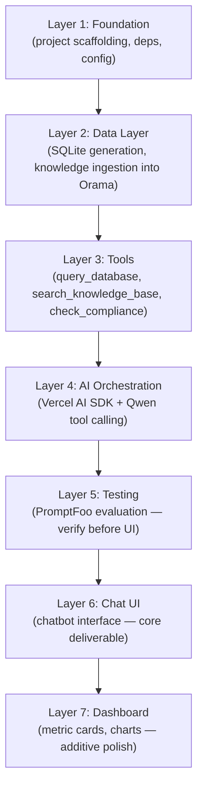

# Build Roadmap

## Execution Order

The build order follows the dependency chain. Each layer depends on the one before it. Nothing can be skipped.



**Key principle:** PromptFoo (Layer 5) comes BEFORE the UI (Layer 6). We validate the AI works correctly via evaluation before spending any time on the frontend. If the AI is broken, a pretty UI is worthless. If the AI is solid, even a minimal UI scores high.

## Layer 1: Foundation

**Goal:** A runnable Next.js project with all dependencies installed and configuration ready.

- [ ] Initialize Next.js project with App Router + TypeScript
- [ ] Install dependencies: `@openrouter/ai-sdk-provider`, `ai` (Vercel AI SDK), `@orama/orama`, `@orama/plugin-data-persistence`, `@huggingface/transformers`, `better-sqlite3`, `promptfoo`
- [ ] Install frontend dependencies: `shadcn`, `tailwindcss`, `gsap`, `lucide-react`, `recharts`
- [ ] Create `.env.example` with `OPENROUTER_API_KEY` and `OPENROUTER_MODEL`
- [ ] Create project folder structure (see below)
- [ ] Verify `npm run dev` starts without errors

### Folder Structure

```
src/
├── app/
│   ├── api/
│   │   ├── chat/          # AI chat endpoint
│   │   └── dashboard/     # Dashboard data endpoints
│   ├── layout.tsx
│   └── page.tsx           # Dashboard + chatbot
├── lib/
│   ├── llm/               # LLM service (OpenRouter + Vercel AI SDK)
│   ├── tools/             # Tool implementations
│   │   ├── query-database.ts
│   │   ├── search-knowledge-base.ts
│   │   └── check-compliance.ts
│   ├── search/            # Orama setup, ingestion, search
│   ├── embeddings/        # nomic-embed-text-v1.5 via Transformers.js
│   ├── db/                # SQLite connection + schema
│   └── config/            # Environment variables, constants
├── components/
│   ├── chat/              # Chat widget components
│   ├── dashboard/         # Dashboard components (cards, charts)
│   └── ui/                # ShadCN components
└── prompts/
    └── system.ts          # System prompt with compliance guide
```

## Layer 2: Data Layer

**Goal:** SQLite database is generated and knowledge base is chunked, embedded, and indexed in Orama.

- [ ] Run `python3 setup-test-database.py` to generate `data/sample.db`
- [ ] Build the SQLite connection module (`lib/db/`) — read-only, singleton
- [ ] Build the embedding service (`lib/embeddings/`) — nomic-embed-text-v1.5 via Transformers.js
- [ ] Build the ingestion service (`lib/search/`) — markdown parsing, structure-aware chunking, recursive sub-chunking, contextual retrieval prefixes, parent-child indexing
- [ ] Build the Orama setup (`lib/search/`) — schema definition, persistence to disk, auto-init on startup
- [ ] Verify: embeddings generate correctly, Orama index persists and loads from disk

## Layer 3: Tools

**Goal:** Each tool works independently and returns correct results.

- [ ] Build `query_database` tool — prompt construction (schema + descriptions + few-shot + CoT), SQL generation, validation pipeline (SELECT-only, whitelist, retry), read-only execution
- [ ] Build `search_knowledge_base` tool — Orama hybrid search (`mode: 'hybrid'`), parent-child chunk resolution, source metadata assembly
- [ ] Build `check_compliance` tool — regex engine with prohibited terms + verbs, surrounding sentence extraction, approved alternative suggestions
- [ ] Verify each tool independently: correct SQL for known questions, correct chunks for known queries, correct violations for known text

## Layer 4: AI Orchestration

**Goal:** The LLM receives questions, calls the right tools, and synthesizes answers with source citations.

- [ ] Build the system prompt (`prompts/system.ts`) — role definition, compliance guide, tool use instructions, source attribution instructions, SQL transparency instructions
- [ ] Wire up the Vercel AI SDK with OpenRouter provider — `streamText` with tool definitions
- [ ] Implement the `/api/chat` route — receives message array, passes to LLM with tools, streams response
- [ ] Implement conversation memory — sliding window (last 20 messages), pass to each call
- [ ] Verify end-to-end: ask a data question, knowledge question, and hybrid question via API

## Layer 5: Testing (PromptFoo)

**Goal:** Verify the AI backend works correctly before building the UI.

- [ ] Set up PromptFoo config (`promptfooconfig.yaml`)
- [ ] Write Tier 1 tests — rubric questions (3 data, 3 knowledge, 2 hybrid)
- [ ] Write Tier 2 tests — edge cases (empty input, gibberish, non-existent brand, destructive SQL, follow-ups, multi-violation compliance)
- [ ] Write Tier 3 tests — component-level (SQL generation, RAG retrieval, compliance regex)
- [ ] Run `npm run eval` — all Tier 1 tests must pass before proceeding to UI
- [ ] Fix any failures identified by the evaluation

## Layer 6: Chat UI

**Goal:** A working chat interface that demonstrates all AI capabilities.

- [ ] Build chat message thread component — renders user and assistant messages
- [ ] Implement streaming display — tokens appear as they arrive
- [ ] Build source citation display — inline citations + collapsible sources panel
- [ ] Build SQL query display — collapsible code block showing the generated SQL
- [ ] Build compliance violation display — highlighted violations with suggestions
- [ ] Build chat input — text input + send button
- [ ] Wire chat UI to `/api/chat` endpoint
- [ ] Verify: all question types work through the UI with proper source display

## Layer 7: Dashboard (Additive)

**Goal:** Make the app feel like a real product.

- [ ] Build dashboard API routes (`/api/dashboard/*`) — pre-defined SQLite queries for metrics
- [ ] Build metric cards — total revenue, active subscribers, ad spend, top product (with MoM comparison)
- [ ] Build 1-2 charts — revenue trend (line chart), brand comparison (bar chart) using ShadCN Charts
- [ ] Build the dashboard layout — nav bar, metric cards grid, charts area
- [ ] Convert chat into a floating widget within the dashboard
- [ ] Add brand selector in the nav (filters dashboard data)
- [ ] Polish: GSAP animations for transitions, responsive layout, loading states

## Definition of Done

The project is complete when:

1. `npm run dev` starts the app with zero additional setup (beyond `.env`)
2. All Tier 1 PromptFoo tests pass
3. The chat UI correctly handles data, knowledge, hybrid, and compliance questions
4. Source citations and SQL queries are displayed in responses
5. Follow-up questions work (conversational memory)
6. The README has clear setup instructions
7. No API keys committed to the repo
