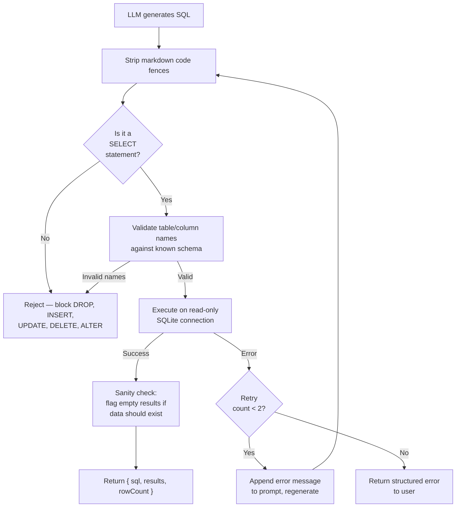

# SQL Integration

## Database: SQLite

The test provides a SQLite database (`data/sample.db`) with 5 tables, 3 brands, 15 products, and 14 months of data (Jan 2025 - Feb 2026).

### Schema

```sql
products (
  asin TEXT PRIMARY KEY,
  title TEXT NOT NULL,
  brand TEXT NOT NULL,           -- 'PureVita Supplements', 'GlowHaven Skincare', 'TailWag Pet Wellness'
  category TEXT NOT NULL,        -- 'Health & Household', 'Beauty & Personal Care', 'Pet Supplies'
  price REAL NOT NULL,           -- retail price in USD
  rating REAL,                   -- average star rating (3.8 - 4.8)
  review_count INTEGER,          -- total review count
  is_subscribe_save_eligible INTEGER DEFAULT 1,  -- 1 = eligible, 0 = not
  launch_date TEXT               -- ISO date string, e.g. '2023-05-15'
)

daily_sales (
  date TEXT NOT NULL,            -- ISO date string, e.g. '2025-09-15'
  asin TEXT NOT NULL,            -- FK to products.asin
  units_ordered INTEGER,         -- units sold that day
  revenue REAL,                  -- revenue in USD (units * price with possible discounting)
  sessions INTEGER,              -- listing page sessions
  page_views INTEGER,            -- listing page views
  buy_box_percentage REAL,       -- Buy Box win rate as percentage (e.g., 95.3)
  unit_session_percentage REAL,  -- conversion rate as percentage
  PRIMARY KEY (date, asin)
)

advertising (
  date TEXT NOT NULL,
  asin TEXT NOT NULL,
  campaign_type TEXT NOT NULL,   -- e.g. 'Sponsored Products - Brand', 'Sponsored Display - Retargeting'
  impressions INTEGER,
  clicks INTEGER,
  spend REAL,                    -- ad spend in USD
  ad_sales REAL,                 -- attributed sales in USD
  ad_units INTEGER,              -- attributed units
  PRIMARY KEY (date, asin, campaign_type)
)

subscriptions (
  date TEXT NOT NULL,
  asin TEXT NOT NULL,
  active_subscribers INTEGER,
  new_subscribers INTEGER,
  cancelled_subscribers INTEGER,
  subscription_revenue REAL,     -- in USD, after S&S discount
  subscription_units INTEGER,
  PRIMARY KEY (date, asin)
)

customer_metrics (
  date TEXT NOT NULL,
  brand TEXT NOT NULL,            -- brand name, matches products.brand
  new_customers INTEGER,
  returning_customers INTEGER,
  new_to_brand_orders INTEGER,
  repeat_orders INTEGER,
  PRIMARY KEY (date, brand)
)
```

### Data Notes

- `daily_sales.buy_box_percentage` for GlowHaven Retinol Night Cream (B0A2GLOWHAVN2) drops to 55-75% from Oct 2025 onward — a simulated Buy Box problem
- `subscriptions.cancelled_subscribers` for TailWag Calming Treats (B0A3TAILWAG02) spikes 3.5x during Sep 1 - Oct 15, 2025 — a simulated churn event
- GlowHaven Skincare products do not have subscription data (skincare has low S&S)
- Seasonal patterns: Q4 holiday boost (Nov-Dec), January dip, Prime Day boost (Jun-Jul)
- Weekend sales are 1.2x weekday baseline

## Text-to-SQL Approach

### Decision: Single-Step with Strong Context Engineering

For a 5-table schema, a single LLM call with a well-structured prompt outperforms multi-agent approaches. Research confirms (2025-2026 benchmarks) that prompt quality matters more than pipeline complexity at this scale.

**Techniques implemented and why:**

| Technique | Impact | Why included |
|---|---|---|
| Full schema with column descriptions | +10-20% accuracy | Single biggest accuracy lever. Comments explain every column's meaning, units, and valid values. |
| Few-shot examples (5-8) | ~+7% accuracy | Domain-specific question/SQL pairs covering date ranges, aggregations, JOINs, brand comparisons. |
| Sample rows (2-3 per table) | Prevents format errors | Model sees date formats ('2025-09-15'), brand name spellings, ASIN formats. |
| Chain-of-thought instruction | +10-15% on complex queries | "Think through: which tables, join conditions, filters, aggregations. Then write SQL." |
| Validate-and-retry loop (max 2) | Recovers most failures | One retry with error message appended resolves most column/syntax errors. Models rarely self-correct after that. |
| Display generated SQL | Trust + transparency | Evaluator sees the query quality. Users catch wrong queries. |

**Techniques NOT implemented and why:**

| Technique | Why skipped | When to use it |
|---|---|---|
| Multi-agent (MAC-SQL style) | Designed for 15-100+ table schemas. Overkill for 5 tables — adds latency and complexity for no accuracy gain. | Enterprise databases with 50+ tables where schema linking is critical. |
| Schema linking via RAG | We have 5 tables — inject the full schema every time. RAG-based table selection only helps at 15+ tables. | Large schemas where the full DDL exceeds the context budget. |
| Query decomposition (DIN-SQL) | ~8% gain on complex queries, negligible on simple ones. Our queries are straightforward aggregations and JOINs. | Multi-table nested subqueries with complex business logic. |
| ReFoRCE (multi-candidate + majority vote) | Generates 3-5 SQL candidates and votes — 3-5x the LLM cost per query. Not justified for this scale. | High-stakes production queries where correctness is critical (financial reporting). |
| Query complexity classifier | Routes simple vs complex queries to different pipelines. Only 1 pipeline needed at this scale. | Cost optimization at scale — route 80% of easy queries to cheap single-step, 20% hard queries to multi-step. |
| Fine-tuning | Not worth it without hundreds of domain-specific labeled queries. | When you have a large labeled dataset and want to reduce per-query cost and latency. |

### Prompt Structure

The SQL generation prompt includes, in order:

1. **Role instruction** — "You are a SQL expert for an Amazon brand management agency. Generate SQLite-compatible SELECT queries only."
2. **Full schema with column descriptions** — the annotated CREATE TABLE statements above, including comments explaining every column's meaning, units, and valid values
3. **Sample rows** — 2-3 rows per table showing actual data formats (date strings, brand name spellings, ASIN formats, numeric ranges)
4. **Few-shot examples** — 5-8 hand-written question/SQL pairs covering common patterns:
   - Date range filtering (`WHERE date >= '2025-01-01' AND date < '2025-02-01'`)
   - Monthly aggregation (`strftime('%Y-%m', date)`)
   - Brand-level comparisons (JOIN products on asin, GROUP BY brand)
   - Top-N queries (ORDER BY ... DESC LIMIT N)
   - Subscription churn calculations
   - Advertising metrics (ROAS, TACoS)
5. **Chain-of-thought instruction** — "Think through: which tables are relevant, what join conditions are needed, what filters apply, what aggregations are needed. Then write the SQL."
6. **The user's question**

### Validation Pipeline



### Security

- SQLite connection is opened as read-only
- Only SELECT statements are executed
- Table/column name whitelist prevents schema exploration attacks
- No user input is interpolated into SQL — the LLM generates the full query from the natural language question

## References

- better-sqlite3 API: https://github.com/WiseLibs/better-sqlite3/blob/master/docs/api.md
- SQLite date functions: https://www.sqlite.org/lang_datefunc.html

## SQL Prompt Engineering

Based on research across 30+ sources (academic papers, production case studies, community best practices), the SQL tool prompt implements these proven techniques:

### Annotated Schema (biggest accuracy lever)

The model receives a hand-written annotated DDL schema with inline `--` comments explaining every column: business meaning, units, valid values, data quirks, and foreign key relationships. Research from Databrain (50K+ production queries analyzed) shows annotated schemas jump accuracy from ~55% to 90%+. This replaces the raw `getSchema()` DDL that lacks column descriptions.

### SQLite Dialect Rules

Explicit rules block common cross-dialect mistakes: no `EXTRACT()` (use `strftime()`), no `RIGHT JOIN`, no `CONCAT()` (use `||`), no `DATEADD` (use `date()` with modifiers). LLMs default to PostgreSQL syntax unless explicitly told otherwise.

### Expanded Few-Shot Examples (15 patterns)

Coverage includes: basic aggregations, JOINs, date ranges, ROAS/TACoS calculations, Buy Box analysis, conversion rate trends, subscription churn detection, multi-brand rankings, month-over-month growth with subqueries, campaign type breakdowns, and product-level metrics. Research shows 9+ examples benefit large-context models.

### Structured Chain-of-Thought

The prompt instructs the model to reason step-by-step: identify tables, determine JOINs, apply filters, choose aggregations, then write SQL. Research confirms structured CoT improves accuracy by 5-15% over direct generation.

### Deterministic Validation

Code-level validators catch what prompt instructions cannot guarantee:
- `date('now')` blocked by regex (the dataset is fixed, not live)
- `UNION` blocked (prevents injection via UNION SELECT)
- `sqlite_master` / `sqlite_schema` blocked (prevents schema exploration)
- Table/column whitelist (only known schema elements pass)
- `isSelectOnly` blocks 13 destructive/meta keywords

### Anti-Hallucination Instruction

After the schema block, the prompt states: "You may ONLY reference the tables and columns listed above. Do not invent or guess column names." Research from Pinterest and Google Cloud confirms explicit column constraints reduce hallucinated schema references.

### References

- [We Evaluated 50,000+ LLM-Generated SQL Queries — Databrain](https://www.usedatabrain.com/blog/llm-sql-evaluation)
- [How we built Text-to-SQL at Pinterest](https://medium.com/pinterest-engineering/how-we-built-text-to-sql-at-pinterest-30bad30dabff)
- [Text to SQL: The Ultimate Guide for 2025](https://medium.com/@ayushgs/text-to-sql-the-ultimate-guide-for-2025-3fa4e78cbdf9)
- [Techniques for improving text-to-SQL — Google Cloud](https://cloud.google.com/blog/products/databases/techniques-for-improving-text-to-sql)
- [DAIL-SQL: Optimized Few-Shot Text-to-SQL](https://bolinding.github.io/papers/vldb24dailsql.pdf)
- [OpenSearch-SQL: Dynamic Few-shot and Consistency Alignment](https://arxiv.org/html/2502.14913v1)
